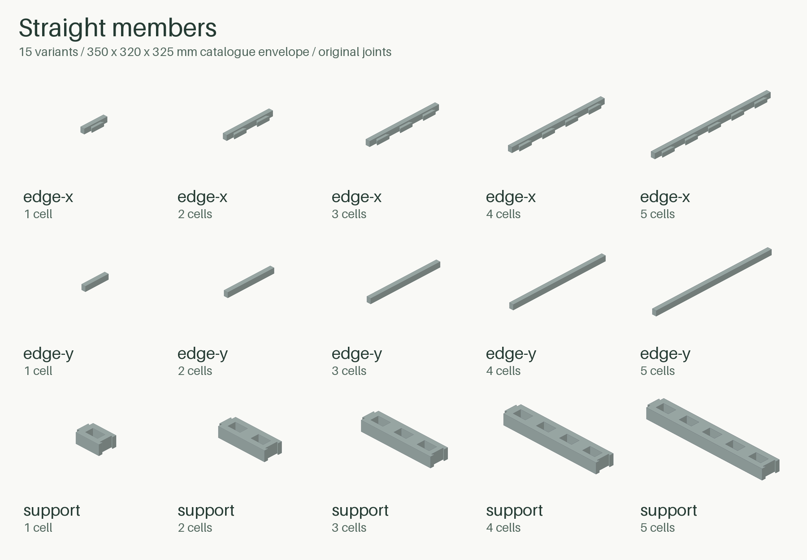
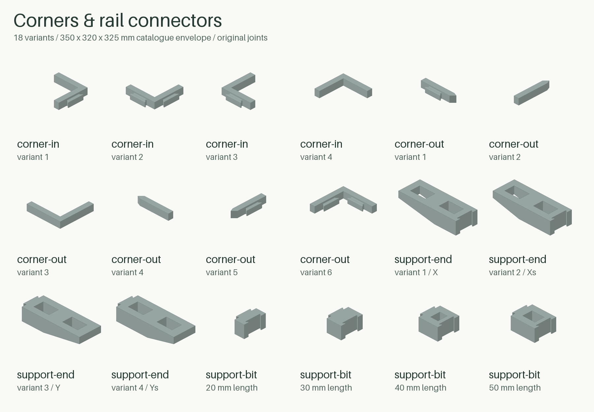

# Cargo-Grid

**Your space. Your grid.** Generate a modular cargo mat in the size you need, add the pieces that suit your load, and keep the design editable in Python.


*Actual STEP-derived renders from this generator, not reference meshes or concept art. Both tiles use the original joint style and nominal 60 mm pitch; the optional holes remove material and need their own fit, strength and support checks.*

Cargo-Grid is an independently authored, MIT-licensed Python/build123d tool. It creates STEP, STL and 3MF files—not a locked set of one-size models. **Pre-release:** geometric compatibility is a design intent, not a certification of printed fit or load capacity.

## Your first 2x1 tile in three steps

You need Python 3.12 or newer with compatible CAD wheels, plus uv. No CAD workbench, Bambu installation, private reference or PyPI publication is required for source use.

### 1. Get the source

Clone this repository or use GitHub's **Code / Download ZIP**, then open a terminal in the extracted repository folder.

### 2. Install the local environment

```sh
uv sync
```

### 3. Generate a real tile

```sh
uv run cargo-grid part --build 150 150 50 --cells 2 1 --output outputs/first-tile
```

That creates one **2x1 tile**, nominally **126x66x13 mm**, using original roofed joints and no optional holes. Look in `outputs/first-tile`: the named STEP is your primary CAD file, the STL is a checked mesh, `job.3mf` carries geometry, and `manifest.json` explains what was generated.

The `--build` values are an example usable print envelope, not an automatically detected printer. Replace them with your own limits. Open the result in a CAD viewer or slicer and choose actual printer/material settings before printing. Use a new output directory for each job; existing jobs are not overwritten.

## Start simple. Add only what you need.

**Keep the original interface.** Default tiles retain the measured joining datums and shared X attachment interface. Printed friction and retention still depend on your machine, material and process.

**Open up the pattern.** Optional round holes can cover only the interior or extend across retained edges and corners. The illustrated 2x1 full pattern has 13 additional 10 mm holes:

```sh
uv run cargo-grid part --build 150 150 50 --cells 2 1 --holes --hole-diameter 10 --hole-scope full --output outputs/open-pattern
```

**Fit a rectangle exactly.** Keep full-pitch cells in the middle and fill leftover dimensions with integrated edge/corner material—not stretched cells:

```sh
uv run cargo-grid layout --build 150 150 50 --footprint 320 230 --filler balanced --output outputs/exact-floor
```

**Make two, not a bigger one.** Add `--quantity 2` to a 2x1 part job. Each unique design gets one STEP/STL; quantities and placements are retained in the manifest and 3MF.

## A parts drawer, not just a floor tile

Use plates and upright stops to add attachment surfaces, edge/corner pieces to finish a run, and the separate rail/connector family where your design needs physical support members. Those rails are not slicer-generated supports and do not imply an unmeasured latch to the mat.


The complete pictured library contains **44 accessory variants** for the documented **350x320x325 mm catalogue envelope**, original joints and default accessory parameters. Every variant is rendered and listed in the [readable attachment inventory](docs/attachments.md). Other build envelopes, lengths and heights can produce additional parametric variants; this is not an exhaustive claim about an unbounded parameter space.

<details>
<summary><strong>See the other 33 variants: straight members, corners and rail connectors</strong></summary>





</details>

*All sheets use the same isometric camera and a common physical scale within each sheet. Scales differ between sheets to keep small connectors and long members legible. Open an image at full size or use the text inventory; colors are illustrative, not filament assignments.*

Generate the whole bounded catalogue in one command:

```sh
uv run cargo-grid catalogue --build 350 320 325 --output outputs/catalogue
```

It includes every ordered tile size that fits and the supported accessory variants. Oversized accessories are listed as omitted rather than shrunk. You can also request one piece, for example:

```sh
uv run cargo-grid part --build 150 150 80 --family plate --cells 1 1 --output outputs/x-plate
```

## Support the roofs without changing the mat

Optional roof supports target the receiving edges—**west and south**—rather than becoming permanent mat geometry. A 2x1 tile has three female roofs and six critical support-selection pads. The slicer creates the actual supports; their contact can extend beyond the nominal pads.

For the intentional PETG-base/PLA-interface workflow, the generator preserves zero top-contact distance, synchronized support/model layers, dense interface spacing and at least two interface layers. The scoped 0.40 mm side-clearance safeguard avoids measured unintended side contact. These are requests for a selected dissimilar-material pair, **not a chemical-compatibility guarantee**. Reusing zero contact with same-material support or an unverified substitution may fuse the parts.

On a full-hole 2x1 tile, the three female-edge round cutouts at `(0,30)`, `(30,0)` and `(90,0)` intentionally contain removable support during printing. Clear them from the underside afterward; the CAD holes are not permanently filled. Protected X openings remain clear in the checked paths.

Every generated Bambu plate defaults to automatic **Convenience Mode** (`Auto For Match`) without a requested physical nozzle map. Foot expansion stays automatic and build-plate-only stays off. Contact correction has scheduled-toolpath evidence; **corrected physical print quality and release still need applicable observations**.

## Advanced reference

The simple commands above use the same maintained CLI/API as the more explicit workflows below. `python -m cargo_grid` is equivalent to the installed `cargo-grid` entry point.

<details>
<summary><strong>Commands, export formats and usable build space</strong></summary>

```sh
uv run cargo-grid --help
uv run cargo-grid part --help
uv run cargo-grid layout --help
uv run cargo-grid catalogue --help
uv run cargo-grid compare-reference --help
```

`part` creates one design with a quantity; `layout` creates an exact rectangular assembly; `catalogue` enumerates the bounded library; `compare-reference` performs an explicit local comparison against a lawful compatible reference archive. No reference is downloaded or uploaded by the generator.

All dimensions are millimeters. `--margin`, `--reserve` and repeatable `--exclude X Y WIDTH DEPTH` constrain the usable envelope. They do not know every printer's purge tower, brim, toolhead reach or sequential-print keep-outs. Inspect those in your selected slicer.

`--filler balanced`, `positive` and `negative` control leftover layout material. Assembly frames describe the floor arrangement; print placement is separate. `--part-gap` controls catalogue packing separation. Native jobs are limited to 36 plates; an over-capacity job fails before export.

Outputs are one checked STEP and optional STL per unique design, `job.3mf`, and a versioned `manifest.json` with parameters, modes, quantities, assembly frames, actual bounds, validation results and omitted/rejected entries. `--no-stl` suppresses STL output. Filenames include parameter hashes.

Core 3MF is geometry, not a multi-plate print configuration. `--bambu` adds native-compatible plate/material/modifier metadata with **diagnostic**, unsliced profile IDs. It does not embed calibrated factory profiles or produce G-code. Existing non-empty output directories, standalone 3MFs and comparison reports are not overwritten; a later CAD/I/O failure can leave diagnostic partial output to inspect before retrying in a new directory.

</details>

<details>
<summary><strong>Original joints, optional holes and compatibility limits</strong></summary>

Original roofed joints are the default. The reference datums are 60 mm pitch and 13 mm height, with male ledges at Z=10 and female ceilings at Z=10.2. An unterminated tile measures `(60*nx+6, 60*ny+6, 13)` at those settings. Changing pitch, height or fit offset changes compatibility assumptions; it is not calibrated shrink compensation.

`--joint-style full-height` is explicitly experimental. Its open pockets leave a very thin negative-X pocket/socket web near the top and can open to the exterior. It is not a structural recommendation, and its male tabs do not fit original roofed female pockets.

Holes are off by default. CLI use requires both `--holes` and `--hole-diameter`; `interior` is the default scope. Explicit `full` uses half-pitch sites including retained edges/corners, excluding X centres. Terminated/filler boundaries and keep-outs can reject sites; the manifest records why.

Read the [geometry contract](docs/geometry.md) before changing interfaces or validation budgets.

</details>

<details>
<summary><strong>Explicit roof-support and identical-tile stack workflows</strong></summary>

Roof support is off by default and limited to original-style tile `part`/`layout` jobs. `--roof-coverage critical` is the enabled default; `full` requests whole-roof coverage. At reference dimensions, selection volumes span Z=9.2 to 11.2 around the Z=10.2 roof to cover multiple layer schedules. The actual contact still needs checking after profile changes.

```sh
uv run cargo-grid part --build 350 320 325 --margin 37 --cells 2 1 --quantity 2 --holes --hole-diameter 10 --hole-scope full --bambu --material "Model PETG" PETG "#778877" --material "Interface PLA" PLA "#dddddd" --nozzle 0.8 --layer-height 0.32 --roof-support --output outputs/roof-job
```

This is an H2D-sized diagnostic example, not an embedded factory profile. Select the real printer, bed, materials and process in the slicer. Logical PETG model/base slot 1 and PLA interface slot 2 remain explicit. `--roof-top-gap` defaults to 0 for this intentional workflow; a positive value selects gapped contact. `--roof-interface-layers` defaults to 2 and `--roof-interface-spacing` to 0; zero contact requires a dense interface and at least two layers.

The zero-contact workflow marks all five contact invariants plus its scoped 0.40 mm XY safeguard against profile resets. It does not change model geometry, masks, prime/flush behavior, thresholds, bridge detection, cooling or speeds. Positive-gap and general support behavior remain separate.

Convenience Mode is `Auto For Match`; Filament-Saving Mode is `Auto For Flush`; Custom grouping is `Manual`. These are distinct from the `normal(manual)` support type. `--roof-nozzles 2 1` requests Custom physical assignment explicitly. `--roof-foot-expansion 0` selects a smaller support foot; omission or `-1` leaves native automatic expansion. An automatically chosen nozzle map is not a locked contract.

Stacks use explicit sacrificial base and lower/upper release volumes between repeated identical tiles:

```sh
uv run cargo-grid part --build 150 150 70 --cells 1 1 --quantity 4 --bambu --material "Model PETG" PETG "#778877" --material "Release PLA" PLA "#dddddd" --nozzle 0.4 --layer-height 0.2 --stack-count 2 --stack-gap 1 --interface-thickness 0.2 --material-roles 1 1 2 --output outputs/stack-job
```

`--stack-count auto` computes a bound from usable height; partial quantities are retained. **Roof supports cannot be combined with stacks.** Mixed catalogue stacking and catalogue/accessory roof support remain unsupported. Separation geometry is not a guarantee of successful physical detachment.

</details>

<details>
<summary><strong>Python API, development and documentation regeneration</strong></summary>

```python
from pathlib import Path
from cargo_grid import BuildVolume, Tile, make_tile
from cargo_grid.export import export_job
from cargo_grid.jobs import Job, tile_design

shape = make_tile(Tile(nx=2, ny=1))
design = tile_design(Tile(nx=2, ny=1, hole_diameter=10, hole_scope="full"))
export_job(Job([design], BuildVolume(150, 150, 50), "part"), Path("outputs/python-job"))
```

`Interface`, `Tile` and `BuildVolume` own geometry/space parameters. `exact_layout`/`layout_job` and `catalogue_job` create the larger workflows. `BambuSettings`/`Material`, `RoofSupportSettings` and `StackSettings` describe optional export requests. `RoofSupportSettings()` selects the guarded PETG/PLA zero-contact defaults; same-material/unsupported roof pairs are rejected.

```sh
uv sync --group dev
uv run ruff check .
uv run ruff format --check .
uv run pytest -q -m "not native and not reference"
uv build
uv run python tools/check_distributions.py dist
```

Use configured feeds and keep `uv.lock` local/ignored. Native/reference tests are optional through explicitly supplied `CARGO_GRID_BAMBU` and `CARGO_GRID_REFERENCE`; they remain skips when unavailable. See [repository instructions](AGENTS.md), [release checks](docs/release-checklist.md) and [gallery reproduction](docs/attachments.md#reproduce-the-images).

Documentation images are the narrow, intentional exception to ignored generated outputs. Raw STEP/render intermediates, environments, study data and private references do not belong in source releases. Rendering uses external workbench tooling, not new runtime dependencies.

</details>

## Open source, with clear boundaries

[The MIT license](LICENSE) covers this independently authored code. Functional measurements of Tora.'s MakerWorld trunk-organizer mat informed the interfaces; that reference has separate restrictive terms. No reference meshes, decorative assets, private files, slicer profiles or workbench code are bundled, and fresh source code does not establish blanket rights over another design.

Python parameters are the editable design; STEP, meshes and images are derived. Cargo-Grid does not connect to a printer, operate the GUI, start prints or certify physical fit, retention, strength or service conditions. There is no browser generator/button yet—the CLI provides the one-command workflows.
