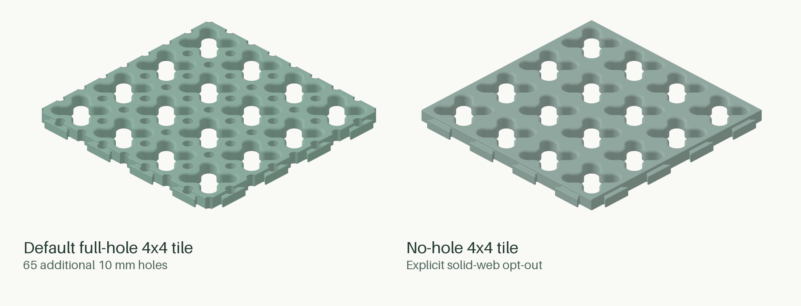
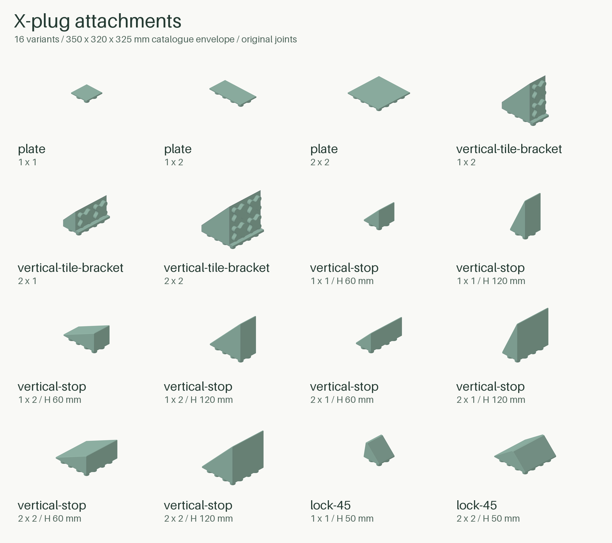
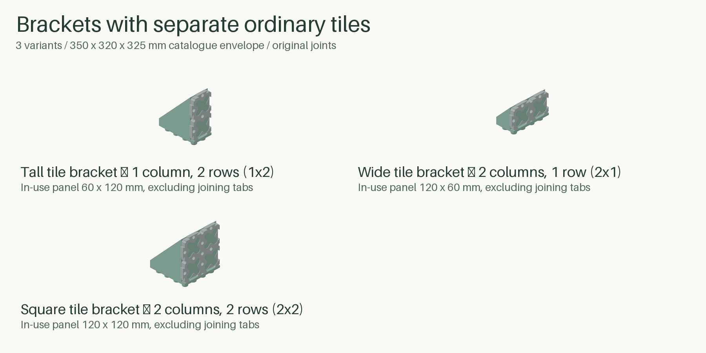
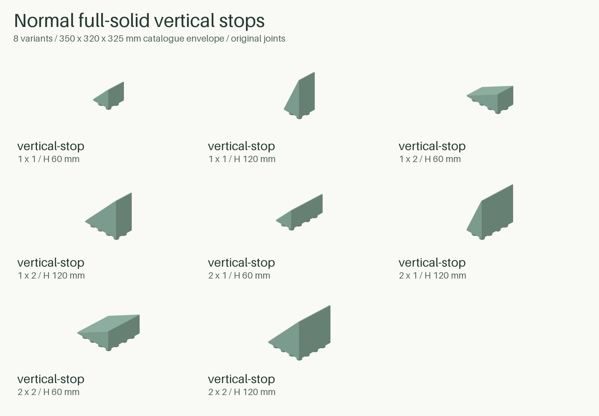
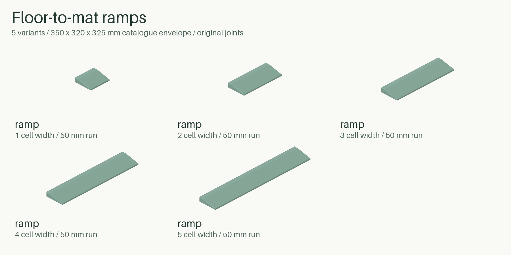

# Cargo-Grid

**Your space. Your grid.** Generate a modular cargo mat in the size you need, add the pieces that suit your load, and keep the design editable in Python.



*Actual STEP-derived renders from this generator, not reference meshes or concept art. Both tiles use the original joint style and nominal 60 mm pitch; the optional holes remove material and need their own fit, strength and support checks.*

Cargo-Grid is an independently authored, MIT-licensed Python/build123d tool. It creates STEP, STL and 3MF files—not a locked set of one-size models. **Pre-release:** geometric compatibility is a design intent, not a certification of printed fit or load capacity.

## Your first 2x1 tile in three steps

You need Python 3.12 or newer with compatible CAD wheels, plus uv. No CAD workbench, Bambu installation, private reference or PyPI publication is required for source use.

### 1. Get the source

Clone this repository or use GitHub's **Code / Download ZIP**, then open a terminal in the extracted repository folder.

### 2. Install the local environment

```sh
uv sync
```

### 3. Generate a real tile

```sh
uv run cargo-grid part --build-width-mm 150 --build-depth-mm 150 --build-height-mm 50 --width-cells 2 --depth-cells 1 --output outputs/first-tile
```

That creates one **2x1 tile**, nominally **126x66x13 mm**, using original roofed joints and no optional holes. Look in `outputs/first-tile`: the named STEP is your primary CAD file, the STL is a checked mesh, `job.3mf` carries geometry, and `manifest.json` explains what was generated.

The three required build dimensions describe the printer, not the tile: `--build-width-mm` is X/left-right, `--build-depth-mm` is Y/front-back, and `--build-height-mm` is Z/maximum print height. All are millimeters with no assumed defaults. Replace the example values with your printer's limits, then inspect the result in your slicer. Use a new output directory for each job; existing jobs are not overwritten.

## Start simple. Add only what you need.

**Keep the original interface.** Default tiles retain the measured joining datums and shared X attachment interface. Printed friction and retention still depend on your machine, material and process.

**Open up the pattern.** Optional round holes can cover only the interior or extend across retained edges and corners. The illustrated 2x1 full pattern has 13 additional 10 mm holes:

```sh
uv run cargo-grid part --build-width-mm 150 --build-depth-mm 150 --build-height-mm 50 --width-cells 2 --depth-cells 1 --holes --hole-diameter-mm 10 --hole-scope full --output outputs/open-pattern
```

**Fit a rectangle exactly.** Keep full-pitch cells in the middle and fill leftover dimensions with integrated edge/corner material—not stretched cells:

```sh
uv run cargo-grid layout --build-width-mm 150 --build-depth-mm 150 --build-height-mm 50 --layout-width-mm 320 --layout-depth-mm 230 --filler-placement balanced --output outputs/exact-floor
```

**Make two, not a bigger one.** Add `--copy-count 2` to a 2x1 part job. Each unique design gets one STEP/STL; quantities and placements are retained in the manifest and 3MF.

## A parts drawer, not just a floor tile

Use floor ramps, plates, vertical tile brackets, normal full-solid stops and angled stops to shape the cargo area, edge/corner pieces to finish a run, and the separate rail/connector family where your design needs physical support members. Those rails are not slicer-generated supports and do not imply an unmeasured latch to the mat.



The complete library contains **54 accessory variants** for the documented **350x320x325 mm catalogue envelope**, original joints and default accessory parameters. **[Browse all 54 parts, each with its own thumbnail beside its name, dimensions and purpose](docs/attachments.md).** The inventory is grouped by family: floor ramps, plates, vertical tile brackets, normal full-solid stops, angled stops, edge strips, inner/outer corners, support rails, rail ends and connectors.

*Every inventory row has a unique actual STEP-derived render and matching alt text. Camera and background are consistent; physical scale is shared within a family, not between families. The overview above is a quick introduction, not a substitute for the individual pictures. Colors are illustrative. Other build envelopes, lengths and heights can produce additional parametric variants beyond this bounded catalogue.*

Generate the whole bounded catalogue in one command:

```sh
uv run cargo-grid catalogue --build-width-mm 350 --build-depth-mm 320 --build-height-mm 325 --output outputs/catalogue
```

It includes every ordered tile size that fits and the supported accessory variants. Oversized accessories are listed as omitted rather than shrunk. You can also request one piece, for example:

```sh
uv run cargo-grid part --build-width-mm 150 --build-depth-mm 150 --build-height-mm 80 --family plate --width-cells 1 --depth-cells 1 --output outputs/x-plate
```

### Generate the whole collection in one editable 3MF

This single command generates every fitting ordered tile size with the 10 mm full-hole pattern plus every fitting accessory family—including ramps, brackets and fully rounded stops—and packs one copy of each design into one editable multi-plate Bambu project:

```sh
uv run cargo-grid catalogue --h2d-dual-safe --build-width-mm 350 --build-depth-mm 320 --build-height-mm 325 --holes --hole-diameter-mm 10 --hole-scope full --bambu --material "Bambu PETG Basic @BBL H2D 0.8 nozzle" PETG "#637b70" --nozzle-diameter-mm 0.8 --layer-height-mm 0.32 --no-stl --output outputs/full-catalogue
```

Open **`outputs/full-catalogue/job.3mf`** as a project. This H2D-specific plan currently contains **79 designs on 23 family-grouped plates**: 25 ordered tile sizes and 54 accessories, with no omissions. Ordinary plates keep every visible model inside the verified dual-nozzle common reach X=25..325, Y=0..320 and Z<=320, inset another 5 mm, with at least 10 mm between model bounds. The 306x306 mm 5x5 tile cannot fit the 300 mm common width, so its isolated plate is labeled **`5x5 TILE - SINGLE NOZZLE ONLY - LEFT`** and explicitly maps filament slot 1 to the left nozzle. Other plates keep automatic Convenience Mode. The bracket plate caption and Bambu object list use the plain in-use Wide 2x1, Tall 1x2 and Square 2x2 names below; stable `vertical-tile-bracket_*` IDs remain in the manifest and placement records. The manifest is the authoritative object/plate inventory and records the exception, family groups, ramp/normal-stop support settings and accessory poses.

The H2D mode embeds the installed-system profile identities for H2D 0.8, 0.32 mm Balanced Strength, Textured PEI and Bambu PETG Basic; it does not embed or replace those factory profiles. This remains an editable unsliced project, not print approval. Automatic mapping still depends on actual loaded filament, and support/brim paths must be checked after slicing. Mixed-catalogue PETG/PLA tile-roof support remains unsupported, so the command does not add zero-contact roof enforcers or a PLA interface slot to the tiles. Generate that explicit tile-only workflow separately when needed.

## Turn an ordinary tile into a vertical panel

**A vertical tile bracket is one solid-backed wedge, not another upright wall.** Attach a separate ordinary tile to its panel-facing X plugs. The tile's entry face meets the bracket, so its **underside faces outward**. The bracket sits inside its base footprint; its full-width internal strip meets the tile at nominal zero gap. This is not calibrated tolerance or a physical load rating.



Name the sizes against the upright panel **in use**, not the rotated print pose: **Wide tile bracket — 2 columns, 1 row (2x1)** has a nominal 120x60 mm panel, **Tall tile bracket — 1 column, 2 rows (1x2)** has a nominal 60x120 mm panel, and **Square tile bracket — 2 columns, 2 rows (2x2)** has a nominal 120x120 mm panel, all excluding joining tabs. In stable IDs and CLI options, the first number is cells left-right across the panel and base X; the second is cells bottom-top on the panel and front-back on base Y. The 1x2 and 2x1 parts are distinct, not aliases.

Generate a narrow, tall bracket as an unsliced Bambu project:

```sh
uv run cargo-grid part --family vertical-tile-bracket --width-cells 1 --depth-cells 2 --build-width-mm 350 --build-depth-mm 320 --build-height-mm 325 --bambu --material "Model PETG" PETG "#637b70" --nozzle-diameter-mm 0.4 --layer-height-mm 0.2 --output outputs/vertical-bracket
```

This exports **only the bracket**. Generate its tile separately with the same `--width-cells 1 --depth-cells 2` using the ordinary tile command. The three bracket sizes are 1x2, 2x1 and 2x2; omitting both cell options for this family chooses 2x1. Bracket depth also sets the upright tile's row count and therefore its panel height. They require the standard 60 mm pitch, 13 mm tile height and zero fit offset. The unreleased `lock-90` family is replaced by `vertical-tile-bracket`, without an alias; `--stop-height-mm` applies to normal `vertical-stop` and angled `lock-45` stops, not these brackets.

The solid backing makes the tile's backed interior round holes **13 mm-deep blind pockets while assembled**, not through-routes for cords or bolts. Perimeter half/quarter cutouts are not all closed bores. Tiles can extend left, right and upward at the same wall origin; downward extension is obstructed by the bracket/base. Detaching the tile exposes its unchanged holes for cleaning; printed removal force and strength are unverified.

**Bambu projects rotate brackets diagonal-face-down, normal stops by their per-design broad-rear-face-down angle and angled stops back-face-down before fit checks and plate packing.** This applies to both single-part and catalogue `--bambu` jobs. STEP, STL and core 3MF keep their model datums; when using those files directly, apply the manifest's recommended print pose in your slicer. Normal Auto support is scoped to normal-stop objects; other accessory families retain their existing project orientation and support behavior. Always inspect bed contact, actual supports, material assignments and warnings; an unsliced project is not print approval.

Edges and corners have selective R2 free top rims. Rails use smaller selective R1 rounds. Bracket front lips use R1 outside the tile's planar bearing land; protected bed-face, plug and seating boundaries are not blanket-rounded. Angled stops are full-width filled CAD wedges, not open-backed wall/web assemblies: one coupled operation applies R1 to all 18 free body edges while exact X plugs and roots remain unchanged.

## Hold cargo with a normal full-solid stop

**`vertical-stop` is a filled CAD wedge, not a tile carrier, open web or 100% infill instruction.** It spans the full base width with a solid cargo face and broad rear print face. There are no wall holes, panel plugs, ledges or separate ribs. The slicer still applies its ordinary perimeter and infill choices to the exported solid.



The first cell count is base **X width**, the second is base **Y depth**, and `--stop-height-mm` is the shoulder-relative **Z height**. The supported catalogue variants are 1x1, 1x2, 2x1 and 2x2, each at exactly 60 or 120 mm. Omitting both options chooses 2x1 and 60 mm. The 2x1/H120 part is the natural full wedge; it does not add an extra raised 45-degree toe.

```sh
uv run cargo-grid part --family vertical-stop --width-cells 2 --depth-cells 1 --stop-height-mm 120 --build-width-mm 350 --build-depth-mm 320 --build-height-mm 325 --bambu --material "Model PETG" PETG "#637b70" --nozzle-diameter-mm 0.4 --layer-height-mm 0.2 --output outputs/vertical-stop
```

Every free exterior edge is rounded R2 in one coupled operation, including the cargo perimeter, diagonal rear boundaries, front/toe outline and underside outer perimeter. The downward X plugs and their existing roots remain exact. STEP, STL and core 3MF retain the source datum; Bambu projects apply each design's measured broad-rear-face-down X rotation before bounds checks and packing.

Normal Auto support is scoped to each `vertical-stop` object without globally enabling support for tiles, brackets or other catalogue entries. In the documented H2D PETG CLI checks, only 2x1/H120 generated support: about 3.87 g at 0.8/0.32 and 2.19 g at 0.4/0.20, reaching the mounting region. Inspect the actual sliced paths and remove support completely before checking fit. Other tested variants generated no Auto support, but profile changes can change that result. These observations are not physical print, removal, strength or load verification.

## Bridge the floor to the mat with a ramp

**`ramp` is a low floor-to-mat transition, not an angled cargo stop.** It rises 13 mm over a fixed 50 mm front-to-back run and carries one existing roofed female tile-edge pocket per 60 mm of width. It receives an unchanged tile's north male edge; the ramp extends away from that edge in positive Y. Rotating the part does not change which joining edge is male or female.



Ramp width is the only grid input: `--width-cells 1` produces 60 mm, 2 produces 120 mm, 3 produces 180 mm and 4 produces 240 mm. Larger integer widths remain available when they fit the selected build envelope. The body stretches by adding 60 mm cells and repeating the unchanged pocket; it never scales the 50 mm run or joint.

```sh
uv run cargo-grid part --family ramp --width-cells 3 --build-width-mm 350 --build-depth-mm 320 --build-height-mm 325 --bambu --material "Model PETG" PETG "#637b70" --nozzle-diameter-mm 0.4 --layer-height-mm 0.2 --output outputs/ramp
```

The source orientation already places the flat underside on the bed. Free outer edges are R2 while the mating boundary retains the existing joining geometry. Ramps require the original roofed 60 mm / 13 mm interface; experimental full-height and custom-interface ramp requests are rejected rather than presented as compatible.

Normal Auto support is scoped to each ramp object for its female pocket roof. In the bounded H2D PETG checks, the 1-cell and 5-cell ramps each had one connected first model layer with no layer-schedule gaps. The first layer reached about Y=48.72 mm at 0.8/0.32 and Y=48.47 mm at 0.4/0.20; the remaining nominal 50 mm nose is the upward-curving tangent tip, not a disconnected first-layer island. Auto generated removable support only around the female pockets. Remove it from the exposed joining edge before assembly. These are slicer observations, not physical adhesion, fit, load or traffic validation.

## Support the roofs without changing the mat

### The problem: a small ceiling over each receiving joint

A **roof** is the thin ceiling above a female joining pocket on the tile's west or south edge. It has open space below it, so its first printed layer needs a temporary foundation to avoid sagging or curling. A 2x1 tile has three such roofs. Cargo-Grid marks those areas for removable support without changing the mat itself.

Use this workflow when printing a **PETG tile with a separate PLA interface on a two-material, two-nozzle setup**. The **interface** is the dense top layer of support that touches the roof; the support below it stays PETG. PLA and PETG are different polymers, which makes a touching, zero-air-gap interface a useful separation strategy for the intended pair. This is not a guarantee for every product or additive: verify your actual spools, and never reuse zero gap with same-material support or an unverified substitute that could fuse.

### Generate the two-tile support job

This copy-paste example requests two full-hole 2x1 tiles and an H2D-sized build envelope. Change the three build dimensions and the nozzle/layer values if your setup differs; the example does not detect or calibrate hardware.

```sh
uv run cargo-grid part --build-width-mm 350 --build-depth-mm 320 --build-height-mm 325 --build-margin-mm 37 --width-cells 2 --depth-cells 1 --copy-count 2 --holes --hole-diameter-mm 10 --hole-scope full --bambu --material "Model PETG" PETG "#778877" --material "Interface PLA" PLA "#dddddd" --nozzle-diameter-mm 0.8 --layer-height-mm 0.32 --roof-support --output outputs/roof-job
```

Open **`outputs/roof-job/job.3mf` as a complete project** in Bambu Studio, not as imported geometry. It is an unsliced diagnostic project with two plates, not a ready-to-print factory profile. Select the actual printer, process, bed and PETG/PLA profiles. The same folder also contains the tile's STEP/STL and `manifest.json`.

### What Cargo-Grid sets for this workflow

Support is enabled under the marked west/south roofs, with PETG in logical slot 1 for the model/support base and PLA in slot 2 for the interface. Six guarded settings are preserved when process profiles change:

| Setting | What it means |
| --- | --- |
| Top contact distance: **0 mm** | No deliberate empty air layer between the PLA interface and roof bottom. |
| Independent support layer height: **off** | Support and model follow the same layer schedule. |
| Top interface spacing: **0 mm** | Request a dense supporting surface, not sparse lines. |
| Top interface layers: **2 by default** | Keep at least two dense PLA layers below each roof. |
| On build plate only: **off** | Do not discard needed support merely because of that filter. |
| Support/object XY distance: **0.40 mm** | Keep lateral clearance from pocket walls while the interface touches the roof vertically. |

Every plate uses automatic **Convenience Mode** (`Auto For Match`); no physical nozzle assignment is locked. Initial support-foot expansion remains automatic. Cargo-Grid does not alter cooling, speeds, bridge thresholds or prime/flush behavior for this contact request.

### Check the preview before printing

1. Confirm the active printer/nozzles, PETG model/base and PLA interface assignments. Slice the project; an enabled Support checkbox alone is not proof that supports were generated.
2. Inspect each west/south pocket in layer view or from below. The final PLA interface surface must directly meet the **bottom** of the first roof layer, with no empty layer. Their nozzle Z values need not match: a layer has thickness. At the checked 0.32 mm schedule, interface top and roof bottom meet at Z=10.32 while the first roof is extruded at Z=10.64.
3. Confirm the protected X-shaped openings are clear and all three roofs retain support on both sides of their round cutout. On this full-hole 2x1 job, the round edge holes at **(0,30), (30,0) and (90,0) are intentionally not open during printing**: they contain removable support. Do not confuse them with blocked X openings or permanent CAD infill.
4. Check for unwanted support touching pocket side walls, an out-of-bounds prime tower or new warnings. Inspect both plates and recheck after any profile/material change. Do not start a print with missing contacts or an unexplained material assignment.

### After printing

Let the part cool according to the material/bed guidance. Reach the support from the open underside and corresponding female edge, remove it, and clear the three temporary support-filled round cutouts before assembly. Check for remaining PLA, damaged roof lips, local curl and excessive joining force. Removal access does not prove easy or damage-free separation.

The settings have geometry and headless toolpath evidence; **corrected physical roof finish, release force, long-term fit and strength are not yet verified**. Record the actual nozzle, layer height, materials and observations rather than assuming one trial validates every profile. Advanced contact, coverage and stacking options follow below.

## Advanced reference

The simple commands above use the same maintained CLI/API as the more explicit workflows below. `python -m cargo_grid` is equivalent to the installed `cargo-grid` entry point.

<details>
<summary><strong>Commands, export formats and usable build space</strong></summary>

```sh
uv run cargo-grid --help
uv run cargo-grid part --help
uv run cargo-grid layout --help
uv run cargo-grid catalogue --help
uv run cargo-grid compare-reference --help
```

`part` creates one design and `--copy-count` repeats it; `layout` creates an exact rectangular assembly; `catalogue` enumerates the bounded library. Normal generation needs no downloaded model or reference file. `compare-reference` is an optional maintainer diagnostic described in the [release checks](docs/release-checklist.md#optional-native-and-reference-checks); it reads an explicitly supplied local 3MF without uploading it.

`--build-width-mm`, `--build-depth-mm` and `--build-height-mm` are all required positive finite dimensions in millimeters: X/left-right, Y/front-back and Z/maximum print height. `--tile-height-mm` changes the tile/interface model height; `--stop-height-mm` changes a stop above its attachment shoulder. The manifest retains its existing `build.x`, `build.y` and `build.z` fields in millimeters.

`--build-margin-mm MM` insets each X/Y side. `--build-reserve-width-mm`, `--build-reserve-depth-mm` and `--build-reserve-height-mm` withhold additional space at positive X, positive Y and top Z. Repeatable `--exclude-rectangle-mm X_MM Y_MM WIDTH_MM DEPTH_MM` removes a build rectangle by its lower-left coordinate and size. These inputs do not know every printer's prime tower, brim, toolhead reach or sequential-print keep-outs; inspect those in your slicer.

`--width-cells` and `--depth-cells` size one grid design; they are counts, not millimeters or copies. Two-axis tiles and accessories require both when either is supplied. `--length-cells` sizes linear edge/rail families. Ramps use only `--width-cells` because their run is fixed. `--layout-width-mm` and `--layout-depth-mm` size the whole assembled floor, while `--copy-count` repeats one part. `--filler-placement balanced`, `positive` and `negative` control leftover layout material. Assembly frames describe the floor arrangement; print placement is separate. `--packing-gap-mm` controls catalogue packing separation. Native jobs are limited to 36 plates; an over-capacity job fails before export.

This unreleased alpha removes the former ambiguous spellings rather than keeping aliases. Every removed option prints its replacement. The main mapping is:

| Former | Current |
| --- | --- |
| `--cells X Y` | `--width-cells X --depth-cells Y`; ramp uses only `--width-cells`, and linear families use `--length-cells` |
| `--footprint W D` | `--layout-width-mm W --layout-depth-mm D` |
| `--quantity N` | `--copy-count N` |
| `--margin`, `--part-gap` | `--build-margin-mm`, `--packing-gap-mm` |
| `--reserve X Y Z` | `--build-reserve-width-mm`, `--build-reserve-depth-mm`, `--build-reserve-height-mm` |
| `--pitch`, `--height`, `--fit-offset` | `--grid-pitch-mm`, `--tile-height-mm`, `--fit-offset-mm` |
| `--nozzle`, `--layer-height`, `--hole-diameter` | `--nozzle-diameter-mm`, `--layer-height-mm`, `--hole-diameter-mm` |
| `--accessory-height`, `--length`, `--variant` | `--stop-height-mm`, `--connector-length-mm`, `--variant-number` |
| former roof/stack gap, spacing, thickness and slot options | the corresponding `--roof-*-mm` / `--stack-*-mm`, `--roof-interface-layer-count`, `--roof-nozzle-slots` and `--stack-material-slots` names shown by `--help` |

Outputs are one checked STEP and optional STL per unique design, `job.3mf`, and a versioned `manifest.json` with parameters, modes, quantities, assembly frames, actual bounds, validation results and omitted/rejected entries. `--no-stl` suppresses STL output. Filenames include parameter hashes. For brackets, normal stops and angled stops, `recommended_print_orientation` distinguishes source-file orientation from the applied Bambu pose; per-plate items record the exact source-to-project matrix, packing rotation and transformed bounds. Ramp and normal-stop manifests also record their object-scoped normal Auto support request.

Core 3MF is geometry, not a multi-plate print configuration. `--bambu` adds native-compatible plate/material/modifier metadata with **diagnostic**, unsliced profile IDs. It does not embed calibrated factory profiles or produce G-code. Existing non-empty output directories, standalone 3MFs and comparison reports are not overwritten; a later CAD/I/O failure can leave diagnostic partial output to inspect before retrying in a new directory.

</details>

<details>
<summary><strong>Original joints, optional holes and compatibility limits</strong></summary>

Original roofed joints are the default. The reference datums are 60 mm pitch and 13 mm height, with male ledges at Z=10 and female ceilings at Z=10.2. An unterminated tile measures `(60*nx+6, 60*ny+6, 13)` at those settings. Changing pitch, height or fit offset changes compatibility assumptions; it is not calibrated shrink compensation.

`--joint-style full-height` is explicitly experimental. Its open pockets leave a very thin negative-X pocket/socket web near the top and can open to the exterior. It is not a structural recommendation, and its male tabs do not fit original roofed female pockets.

Holes are off by default. CLI use requires both `--holes` and `--hole-diameter-mm`; `interior` is the default scope. Explicit `full` uses half-pitch sites including retained edges/corners, excluding X centres. Terminated/filler boundaries and keep-outs can reject sites; the manifest records why.

Read the [geometry contract](docs/geometry.md) before changing interfaces or validation budgets.

</details>

<details>
<summary><strong>Explicit roof-support and identical-tile stack workflows</strong></summary>

Roof support is off by default and limited to original-style tile `part`/`layout` jobs. The [beginner workflow](#support-the-roofs-without-changing-the-mat) provides the complete command and preview/removal checks. `--roof-coverage critical` is the enabled default; `full` requests whole-roof coverage. At reference dimensions, selection volumes span Z=9.2 to 11.2 around the Z=10.2 roof to cover multiple layer schedules.

`--roof-top-gap-mm` defaults to 0 for the intentional PETG/PLA workflow; a positive value selects gapped contact. `--roof-interface-layer-count` defaults to 2 and `--roof-interface-spacing-mm` to 0; zero contact requires a dense interface and at least two layers.

The zero-contact workflow marks all five contact invariants plus its scoped 0.40 mm XY safeguard against profile resets. It does not change model geometry, masks, prime/flush behavior, thresholds, bridge detection, cooling or speeds. Positive-gap and general support behavior remain separate.

Convenience Mode is `Auto For Match`; Filament-Saving Mode is `Auto For Flush`; Custom grouping is `Manual`. These are distinct from the `normal(manual)` support type. `--roof-nozzle-slots 2 1` requests Custom physical assignment explicitly. `--roof-foot-expansion-mm 0` selects a smaller support foot; omission or `-1` leaves native automatic expansion. An automatically chosen nozzle map is not a locked contract.

Stacks use explicit sacrificial base and lower/upper release volumes between repeated identical tiles:

```sh
uv run cargo-grid part --build-width-mm 150 --build-depth-mm 150 --build-height-mm 70 --width-cells 1 --depth-cells 1 --copy-count 4 --bambu --material "Model PETG" PETG "#778877" --material "Release PLA" PLA "#dddddd" --nozzle-diameter-mm 0.4 --layer-height-mm 0.2 --stack-count 2 --stack-gap-mm 1 --stack-interface-thickness-mm 0.2 --stack-material-slots 1 1 2 --output outputs/stack-job
```

`--stack-count auto` computes a bound from usable height; partial quantities are retained. **Roof supports cannot be combined with stacks.** Mixed catalogue stacking and catalogue/accessory roof support remain unsupported. Separation geometry is not a guarantee of successful physical detachment.

</details>

<details>
<summary><strong>Python API, development and documentation regeneration</strong></summary>

```python
from pathlib import Path
from cargo_grid import BuildVolume, Tile, make_tile
from cargo_grid.export import export_job
from cargo_grid.jobs import Job, tile_design

shape = make_tile(Tile(nx=2, ny=1))
design = tile_design(Tile(nx=2, ny=1, hole_diameter=10, hole_scope="full"))
export_job(Job([design], BuildVolume(150, 150, 50), "part"), Path("outputs/python-job"))
```

`Interface`, `Tile` and `BuildVolume` own geometry/space parameters. `exact_layout`/`layout_job` and `catalogue_job` create the larger workflows. `BambuSettings`/`Material`, `RoofSupportSettings` and `StackSettings` describe optional export requests. `RoofSupportSettings()` selects the guarded PETG/PLA zero-contact defaults; same-material/unsupported roof pairs are rejected.

Use `accessory_design(Accessory("vertical-tile-bracket", nx=1, ny=2))` from `cargo_grid.catalogue` / `cargo_grid.accessories` for the narrow tall bracket. API calls use explicit supported mounting cells. For a Bambu catalogue, call `catalogue_job(build, orient_for_bambu=True)` so eligibility uses the same transformed bounds as Bambu packing; the CLI does this automatically with `--bambu`. Custom-interface catalogues retain other supported families but omit the reference-only bracket family.

Use `accessory_design(Accessory("vertical-stop", nx=2, ny=1, height=120))` for the selected tall normal stop. API height is explicit and uses millimeters above the attachment shoulder. The resulting `Design` carries its dynamic print rotation and object-scoped normal Auto settings; source geometry remains in the model datum.

```sh
uv sync --group dev
uv run ruff check .
uv run ruff format --check .
uv run pytest -q -m "not native and not reference"
uv build
uv run python tools/check_distributions.py dist
```

Use configured feeds and keep `uv.lock` local/ignored. Native/reference tests are optional through explicitly supplied `CARGO_GRID_BAMBU` and `CARGO_GRID_REFERENCE`; they remain skips when unavailable. See [repository instructions](AGENTS.md), [release checks](docs/release-checklist.md) and [gallery reproduction](docs/attachments.md#reproduce-the-images).

Documentation images are the narrow, intentional exception to ignored generated outputs. Raw STEP/render intermediates, environments, study data and private references do not belong in source releases. Rendering uses external workbench tooling, not new runtime dependencies.

</details>

## Open source, with clear boundaries

[The MIT license](LICENSE) covers this independently authored code. Functional measurements of Tora.'s MakerWorld trunk-organizer mat informed the interfaces; that reference has separate restrictive terms. No reference meshes, decorative assets, private files, slicer profiles or workbench code are bundled, and fresh source code does not establish blanket rights over another design.

Python parameters are the editable design; STEP, meshes and images are derived. Cargo-Grid does not connect to a printer, operate the GUI, start prints or certify physical fit, retention, strength or service conditions. There is no browser generator/button yet—the CLI provides the one-command workflows.
