# Complete attachment inventory

This page lists the 56 accessories that fit the documented 350 x 320 x 325 mm build space with original joints and default settings. Each thumbnail comes from the STEP generated for that part. Other build spaces can allow different rail lengths or ramp widths.

Click a thumbnail to open the full-size image. The code name beside it is the name used by the generator. Parts in one family share a scale; different families use different scales so small details stay readable. Colors only separate the shapes visually.

[Back to the beginner guide](../README.md) / [Thumbnail dimensions, hashes and source provenance](images/attachments/manifest.json)

Bracket names state both footprints. Deep tall is floor 1x2 -> wall 1x2, Wide low is floor 2x1 -> wall 2x1 and Deep square is floor 2x2 -> wall 2x2. Shallow tall is floor 1x1 -> wall 1x2, and Shallow wide is floor 2x1 -> wall 2x2. The two shallow IDs spell out `base..._wall...`; the original three keep their shorter IDs. All five use the standard 60 mm pitch, 13 mm tile height and zero fit offset.

The individual thumbnails show the bracket alone. The [family view](images/vertical-tile-brackets.png) adds separate floor and wall tiles to show assembly; those tiles are not included in the bracket export. The wall tile's underside faces outward. Holes covered by the solid backing are blind while assembled.

Ramp names give width along the tile edge in 60 mm cells. Every ramp keeps the same 50 mm run and 13 mm rise, with one original female pocket per cell. The ramp receives a tile's north male edge and extends in positive Y. Full-height and custom-interface ramps are not available.

Normal `vertical-stop` names give base X cells, base Y cells and H60/H120 shoulder height. They are filled CAD wedges with no wall holes, panel connectors or ledges. The slicer still chooses perimeters and infill.

Original-style edge/corner bodies and straight rail bodies use R3. The acute rail ends use smaller complete rounds where required by fit and portable STEP checks. Plates and angled stops use R2. Brackets use R2 on thick free edges and R1 around the thin bearing lip; normal stops and ramps keep R2. Tile joints, rail joints, bracket bearing surfaces and X attachments keep their mating geometry.

Bambu projects put original brackets on their diagonal rear face, shallow brackets on a broad side, normal stops on their broad rear face and angled stops on their rear face before packing. STEP, STL and core 3MF keep model orientation. Ramps, normal stops and shallow brackets request object-level normal Auto support. Remove all support from mating regions before assembly.

## Floor ramps

<table><thead><tr><th width="206">Thumbnail</th><th>Name</th><th>Size / variant</th><th>What it does</th></tr></thead><tbody>
<tr><td width="206"><a href="images/attachments/ramp-1.png">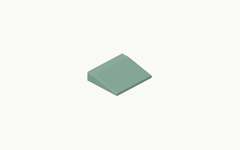</a></td><td><code>ramp_<wbr>1_<wbr>original</code><br>Key: <code>ramp-1</code></td><td>1 cell width / 50 mm run<br>Bounds: 60.0 x 50.0 x 13.0 mm</td><td>A 13 mm floor-to-mat transition with a fixed 50 mm run and one original roofed female tile-edge pocket per 60 mm width cell. Normal Auto support is scoped to its exposed pocket roofs.</td></tr>
<tr><td width="206"><a href="images/attachments/ramp-2.png">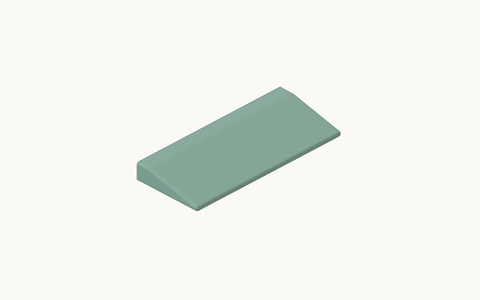</a></td><td><code>ramp_<wbr>2_<wbr>original</code><br>Key: <code>ramp-2</code></td><td>2 cell width / 50 mm run<br>Bounds: 120.0 x 50.0 x 13.0 mm</td><td>A 13 mm floor-to-mat transition with a fixed 50 mm run and one original roofed female tile-edge pocket per 60 mm width cell. Normal Auto support is scoped to its exposed pocket roofs.</td></tr>
<tr><td width="206"><a href="images/attachments/ramp-3.png">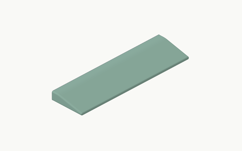</a></td><td><code>ramp_<wbr>3_<wbr>original</code><br>Key: <code>ramp-3</code></td><td>3 cell width / 50 mm run<br>Bounds: 180.0 x 50.0 x 13.0 mm</td><td>A 13 mm floor-to-mat transition with a fixed 50 mm run and one original roofed female tile-edge pocket per 60 mm width cell. Normal Auto support is scoped to its exposed pocket roofs.</td></tr>
<tr><td width="206"><a href="images/attachments/ramp-4.png">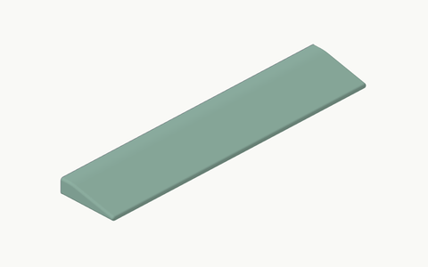</a></td><td><code>ramp_<wbr>4_<wbr>original</code><br>Key: <code>ramp-4</code></td><td>4 cell width / 50 mm run<br>Bounds: 240.0 x 50.0 x 13.0 mm</td><td>A 13 mm floor-to-mat transition with a fixed 50 mm run and one original roofed female tile-edge pocket per 60 mm width cell. Normal Auto support is scoped to its exposed pocket roofs.</td></tr>
<tr><td width="206"><a href="images/attachments/ramp-5.png">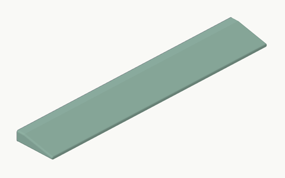</a></td><td><code>ramp_<wbr>5_<wbr>original</code><br>Key: <code>ramp-5</code></td><td>5 cell width / 50 mm run<br>Bounds: 300.0 x 50.0 x 13.0 mm</td><td>A 13 mm floor-to-mat transition with a fixed 50 mm run and one original roofed female tile-edge pocket per 60 mm width cell. Normal Auto support is scoped to its exposed pocket roofs.</td></tr>
</tbody></table>

## Attachment plates

<table><thead><tr><th width="206">Thumbnail</th><th>Name</th><th>Size / variant</th><th>What it does</th></tr></thead><tbody>
<tr><td width="206"><a href="images/attachments/plate-1x1.png">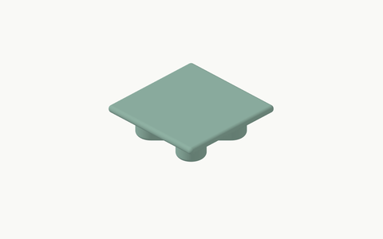</a></td><td><code>plate_<wbr>1x1_<wbr>original</code><br>Key: <code>plate-1x1</code></td><td>1 x 1<br>Bounds: 60.0 x 60.0 x 16.9 mm</td><td>A flat R2 body with exact X plugs underneath. Bambu projects place its broad body face down so the plugs grow upward.</td></tr>
<tr><td width="206"><a href="images/attachments/plate-1x2.png">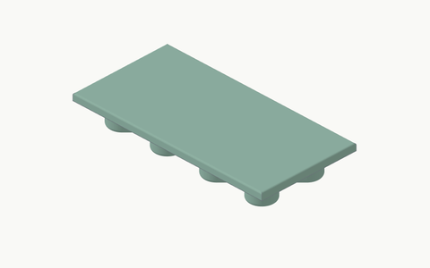</a></td><td><code>plate_<wbr>1x2_<wbr>original</code><br>Key: <code>plate-1x2</code></td><td>1 x 2<br>Bounds: 60.0 x 120.0 x 16.9 mm</td><td>A flat R2 body with exact X plugs underneath. Bambu projects place its broad body face down so the plugs grow upward.</td></tr>
<tr><td width="206"><a href="images/attachments/plate-2x2.png">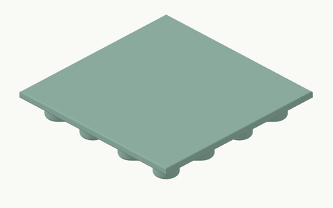</a></td><td><code>plate_<wbr>2x2_<wbr>original</code><br>Key: <code>plate-2x2</code></td><td>2 x 2<br>Bounds: 120.0 x 120.0 x 16.9 mm</td><td>A flat R2 body with exact X plugs underneath. Bambu projects place its broad body face down so the plugs grow upward.</td></tr>
</tbody></table>

## Vertical tile brackets

<table><thead><tr><th width="206">Thumbnail</th><th>Name</th><th>Size / variant</th><th>What it does</th></tr></thead><tbody>
<tr><td width="206"><a href="images/attachments/vertical-tile-bracket-1x2.png">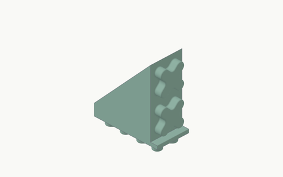</a></td><td><code>vertical-tile-bracket_<wbr>1x2_<wbr>original</code><br>Key: <code>vertical-tile-bracket-1x2</code></td><td>floor base 1 x 2 / wall 1 x 2<br>Bounds: 60.0 x 120.0 x 140.4 mm</td><td>A filled mixed-R1/R2 wedge carrying a separate ordinary tile vertically. Three original variants match floor depth to wall height; two shallow variants keep one floor row under a two-row wall.</td></tr>
<tr><td width="206"><a href="images/attachments/vertical-tile-bracket-2x1.png">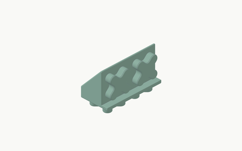</a></td><td><code>vertical-tile-bracket_<wbr>2x1_<wbr>original</code><br>Key: <code>vertical-tile-bracket-2x1</code></td><td>floor base 2 x 1 / wall 2 x 1<br>Bounds: 120.0 x 60.0 x 80.4 mm</td><td>A filled mixed-R1/R2 wedge carrying a separate ordinary tile vertically. Three original variants match floor depth to wall height; two shallow variants keep one floor row under a two-row wall.</td></tr>
<tr><td width="206"><a href="images/attachments/vertical-tile-bracket-2x2.png">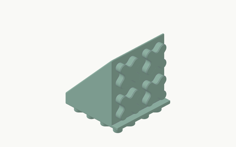</a></td><td><code>vertical-tile-bracket_<wbr>2x2_<wbr>original</code><br>Key: <code>vertical-tile-bracket-2x2</code></td><td>floor base 2 x 2 / wall 2 x 2<br>Bounds: 120.0 x 120.0 x 140.4 mm</td><td>A filled mixed-R1/R2 wedge carrying a separate ordinary tile vertically. Three original variants match floor depth to wall height; two shallow variants keep one floor row under a two-row wall.</td></tr>
<tr><td width="206"><a href="images/attachments/vertical-tile-bracket-base1x1-wall1x2.png">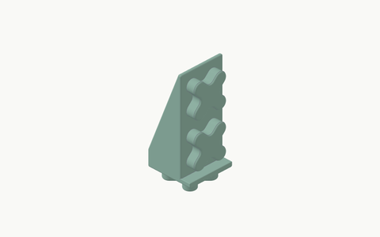</a></td><td><code>vertical-tile-bracket_<wbr>base1x1_<wbr>wall1x2_<wbr>original</code><br>Key: <code>vertical-tile-bracket-base1x1-wall1x2</code></td><td>floor base 1 x 1 / wall 1 x 2<br>Bounds: 60.0 x 60.0 x 140.4 mm</td><td>A filled mixed-R1/R2 wedge carrying a separate ordinary tile vertically. Three original variants match floor depth to wall height; two shallow variants keep one floor row under a two-row wall.</td></tr>
<tr><td width="206"><a href="images/attachments/vertical-tile-bracket-base2x1-wall2x2.png">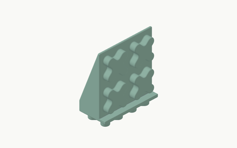</a></td><td><code>vertical-tile-bracket_<wbr>base2x1_<wbr>wall2x2_<wbr>original</code><br>Key: <code>vertical-tile-bracket-base2x1-wall2x2</code></td><td>floor base 2 x 1 / wall 2 x 2<br>Bounds: 120.0 x 60.0 x 140.4 mm</td><td>A filled mixed-R1/R2 wedge carrying a separate ordinary tile vertically. Three original variants match floor depth to wall height; two shallow variants keep one floor row under a two-row wall.</td></tr>
</tbody></table>

## Normal full-solid stops

<table><thead><tr><th width="206">Thumbnail</th><th>Name</th><th>Size / variant</th><th>What it does</th></tr></thead><tbody>
<tr><td width="206"><a href="images/attachments/vertical-stop-1x1-h60.png">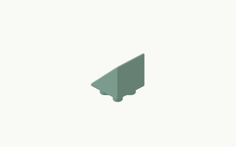</a></td><td><code>vertical-stop_<wbr>1x1_<wbr>h60_<wbr>original</code><br>Key: <code>vertical-stop-1x1-h60</code></td><td>1 x 1 / H 60 mm<br>Bounds: 60.0 x 60.0 x 72.8 mm</td><td>A full-width filled cargo wedge with no wall holes or open ribs. Every free outer edge is R2 while X plugs remain exact. Bambu projects place its broad rear face down and scope normal Auto support to this object.</td></tr>
<tr><td width="206"><a href="images/attachments/vertical-stop-1x1-h120.png">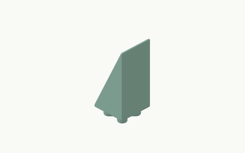</a></td><td><code>vertical-stop_<wbr>1x1_<wbr>h120_<wbr>original</code><br>Key: <code>vertical-stop-1x1-h120</code></td><td>1 x 1 / H 120 mm<br>Bounds: 60.0 x 60.0 x 132.8 mm</td><td>A full-width filled cargo wedge with no wall holes or open ribs. Every free outer edge is R2 while X plugs remain exact. Bambu projects place its broad rear face down and scope normal Auto support to this object.</td></tr>
<tr><td width="206"><a href="images/attachments/vertical-stop-1x2-h60.png">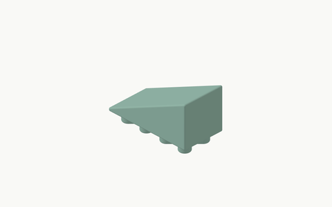</a></td><td><code>vertical-stop_<wbr>1x2_<wbr>h60_<wbr>original</code><br>Key: <code>vertical-stop-1x2-h60</code></td><td>1 x 2 / H 60 mm<br>Bounds: 60.0 x 120.0 x 72.8 mm</td><td>A full-width filled cargo wedge with no wall holes or open ribs. Every free outer edge is R2 while X plugs remain exact. Bambu projects place its broad rear face down and scope normal Auto support to this object.</td></tr>
<tr><td width="206"><a href="images/attachments/vertical-stop-1x2-h120.png">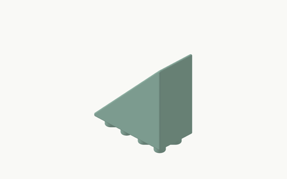</a></td><td><code>vertical-stop_<wbr>1x2_<wbr>h120_<wbr>original</code><br>Key: <code>vertical-stop-1x2-h120</code></td><td>1 x 2 / H 120 mm<br>Bounds: 60.0 x 120.0 x 132.8 mm</td><td>A full-width filled cargo wedge with no wall holes or open ribs. Every free outer edge is R2 while X plugs remain exact. Bambu projects place its broad rear face down and scope normal Auto support to this object.</td></tr>
<tr><td width="206"><a href="images/attachments/vertical-stop-2x1-h60.png">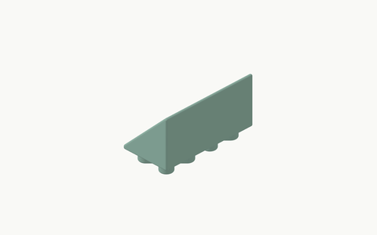</a></td><td><code>vertical-stop_<wbr>2x1_<wbr>h60_<wbr>original</code><br>Key: <code>vertical-stop-2x1-h60</code></td><td>2 x 1 / H 60 mm<br>Bounds: 120.0 x 60.0 x 72.8 mm</td><td>A full-width filled cargo wedge with no wall holes or open ribs. Every free outer edge is R2 while X plugs remain exact. Bambu projects place its broad rear face down and scope normal Auto support to this object.</td></tr>
<tr><td width="206"><a href="images/attachments/vertical-stop-2x1-h120.png">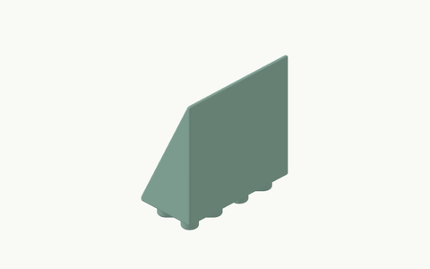</a></td><td><code>vertical-stop_<wbr>2x1_<wbr>h120_<wbr>original</code><br>Key: <code>vertical-stop-2x1-h120</code></td><td>2 x 1 / H 120 mm<br>Bounds: 120.0 x 60.0 x 132.8 mm</td><td>A full-width filled cargo wedge with no wall holes or open ribs. Every free outer edge is R2 while X plugs remain exact. Bambu projects place its broad rear face down and scope normal Auto support to this object.</td></tr>
<tr><td width="206"><a href="images/attachments/vertical-stop-2x2-h60.png">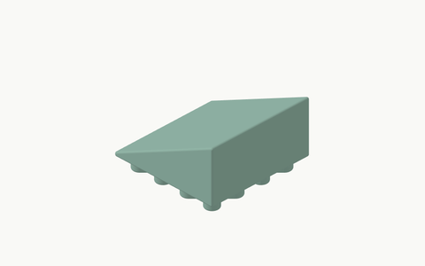</a></td><td><code>vertical-stop_<wbr>2x2_<wbr>h60_<wbr>original</code><br>Key: <code>vertical-stop-2x2-h60</code></td><td>2 x 2 / H 60 mm<br>Bounds: 120.0 x 120.0 x 72.8 mm</td><td>A full-width filled cargo wedge with no wall holes or open ribs. Every free outer edge is R2 while X plugs remain exact. Bambu projects place its broad rear face down and scope normal Auto support to this object.</td></tr>
<tr><td width="206"><a href="images/attachments/vertical-stop-2x2-h120.png">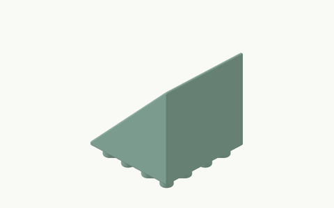</a></td><td><code>vertical-stop_<wbr>2x2_<wbr>h120_<wbr>original</code><br>Key: <code>vertical-stop-2x2-h120</code></td><td>2 x 2 / H 120 mm<br>Bounds: 120.0 x 120.0 x 132.8 mm</td><td>A full-width filled cargo wedge with no wall holes or open ribs. Every free outer edge is R2 while X plugs remain exact. Bambu projects place its broad rear face down and scope normal Auto support to this object.</td></tr>
</tbody></table>

## Angled stops

<table><thead><tr><th width="206">Thumbnail</th><th>Name</th><th>Size / variant</th><th>What it does</th></tr></thead><tbody>
<tr><td width="206"><a href="images/attachments/lock-45-1x1.png">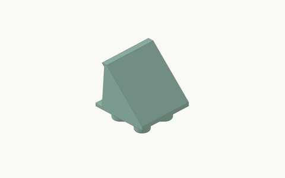</a></td><td><code>lock-45_<wbr>1x1_<wbr>h50_<wbr>original</code><br>Key: <code>lock-45-1x1</code></td><td>1 x 1 / H 50 mm<br>Bounds: 60.0 x 60.0 x 62.8 mm</td><td>A full-width filled angled cargo wedge with a 6 mm horizontal cap and R2 on every free body edge. Exact X plugs and roots remain protected. Use the recommended back-face-down print pose.</td></tr>
<tr><td width="206"><a href="images/attachments/lock-45-2x2.png">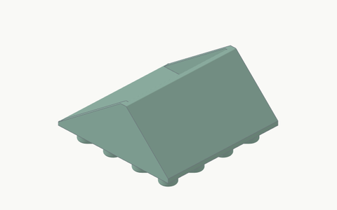</a></td><td><code>lock-45_<wbr>2x2_<wbr>h50_<wbr>original</code><br>Key: <code>lock-45-2x2</code></td><td>2 x 2 / H 50 mm<br>Bounds: 120.0 x 120.0 x 62.8 mm</td><td>A full-width filled angled cargo wedge with a 6 mm horizontal cap and R2 on every free body edge. Exact X plugs and roots remain protected. Use the recommended back-face-down print pose.</td></tr>
</tbody></table>

## Male edge strips

<table><thead><tr><th width="206">Thumbnail</th><th>Name</th><th>Size / variant</th><th>What it does</th></tr></thead><tbody>
<tr><td width="206"><a href="images/attachments/edge-x-1.png">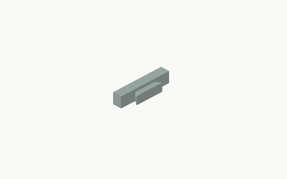</a></td><td><code>edge-x_<wbr>1_<wbr>original</code><br>Key: <code>edge-x-1</code></td><td>1 cell<br>Bounds: 60.0 x 16.0 x 13.0 mm</td><td>An R3 finishing strip with male tile-facing joins; length follows the cell count.</td></tr>
<tr><td width="206"><a href="images/attachments/edge-x-2.png">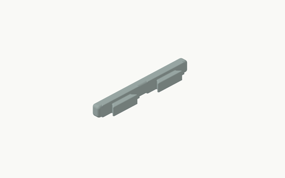</a></td><td><code>edge-x_<wbr>2_<wbr>original</code><br>Key: <code>edge-x-2</code></td><td>2 cells<br>Bounds: 120.0 x 16.0 x 13.0 mm</td><td>An R3 finishing strip with male tile-facing joins; length follows the cell count.</td></tr>
<tr><td width="206"><a href="images/attachments/edge-x-3.png">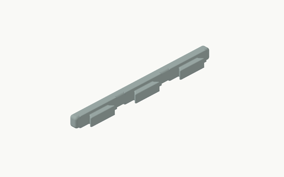</a></td><td><code>edge-x_<wbr>3_<wbr>original</code><br>Key: <code>edge-x-3</code></td><td>3 cells<br>Bounds: 180.0 x 16.0 x 13.0 mm</td><td>An R3 finishing strip with male tile-facing joins; length follows the cell count.</td></tr>
<tr><td width="206"><a href="images/attachments/edge-x-4.png">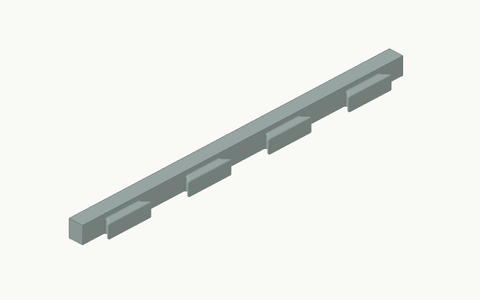</a></td><td><code>edge-x_<wbr>4_<wbr>original</code><br>Key: <code>edge-x-4</code></td><td>4 cells<br>Bounds: 240.0 x 16.0 x 13.0 mm</td><td>An R3 finishing strip with male tile-facing joins; length follows the cell count.</td></tr>
<tr><td width="206"><a href="images/attachments/edge-x-5.png">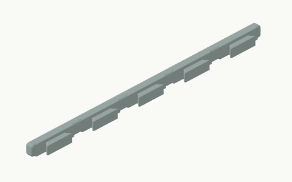</a></td><td><code>edge-x_<wbr>5_<wbr>original</code><br>Key: <code>edge-x-5</code></td><td>5 cells<br>Bounds: 300.0 x 16.0 x 13.0 mm</td><td>An R3 finishing strip with male tile-facing joins; length follows the cell count.</td></tr>
</tbody></table>

## Female edge strips

<table><thead><tr><th width="206">Thumbnail</th><th>Name</th><th>Size / variant</th><th>What it does</th></tr></thead><tbody>
<tr><td width="206"><a href="images/attachments/edge-y-1.png">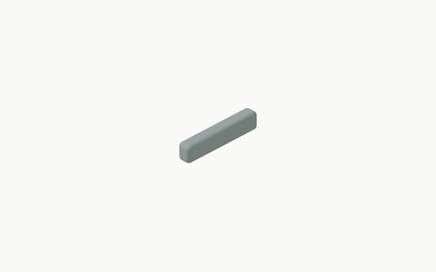</a></td><td><code>edge-y_<wbr>1_<wbr>original</code><br>Key: <code>edge-y-1</code></td><td>1 cell<br>Bounds: 60.0 x 10.0 x 13.0 mm</td><td>An R3 finishing strip with female tile-facing joins; length follows the cell count.</td></tr>
<tr><td width="206"><a href="images/attachments/edge-y-2.png">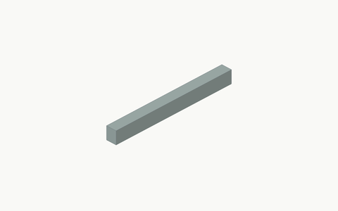</a></td><td><code>edge-y_<wbr>2_<wbr>original</code><br>Key: <code>edge-y-2</code></td><td>2 cells<br>Bounds: 120.0 x 10.0 x 13.0 mm</td><td>An R3 finishing strip with female tile-facing joins; length follows the cell count.</td></tr>
<tr><td width="206"><a href="images/attachments/edge-y-3.png">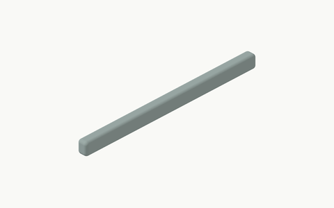</a></td><td><code>edge-y_<wbr>3_<wbr>original</code><br>Key: <code>edge-y-3</code></td><td>3 cells<br>Bounds: 180.0 x 10.0 x 13.0 mm</td><td>An R3 finishing strip with female tile-facing joins; length follows the cell count.</td></tr>
<tr><td width="206"><a href="images/attachments/edge-y-4.png">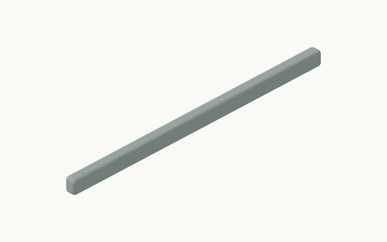</a></td><td><code>edge-y_<wbr>4_<wbr>original</code><br>Key: <code>edge-y-4</code></td><td>4 cells<br>Bounds: 240.0 x 10.0 x 13.0 mm</td><td>An R3 finishing strip with female tile-facing joins; length follows the cell count.</td></tr>
<tr><td width="206"><a href="images/attachments/edge-y-5.png">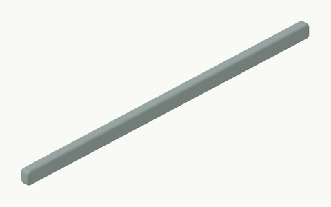</a></td><td><code>edge-y_<wbr>5_<wbr>original</code><br>Key: <code>edge-y-5</code></td><td>5 cells<br>Bounds: 300.0 x 10.0 x 13.0 mm</td><td>An R3 finishing strip with female tile-facing joins; length follows the cell count.</td></tr>
</tbody></table>

## Inner corners

<table><thead><tr><th width="206">Thumbnail</th><th>Name</th><th>Size / variant</th><th>What it does</th></tr></thead><tbody>
<tr><td width="206"><a href="images/attachments/corner-in-v1.png">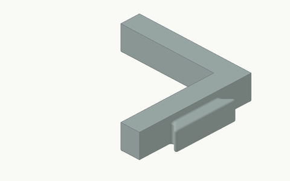</a></td><td><code>corner-in_<wbr>v1_<wbr>original</code><br>Key: <code>corner-in-v1</code></td><td>variant 1<br>Bounds: 60.0 x 66.0 x 13.0 mm</td><td>An R3 corner finishing piece in one of four supported joining arrangements.</td></tr>
<tr><td width="206"><a href="images/attachments/corner-in-v2.png">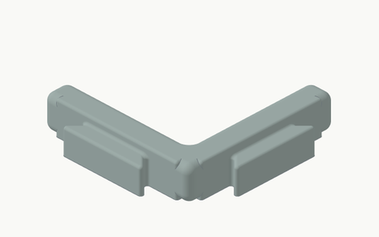</a></td><td><code>corner-in_<wbr>v2_<wbr>original</code><br>Key: <code>corner-in-v2</code></td><td>variant 2<br>Bounds: 66.0 x 66.0 x 13.0 mm</td><td>An R3 corner finishing piece in one of four supported joining arrangements.</td></tr>
<tr><td width="206"><a href="images/attachments/corner-in-v3.png">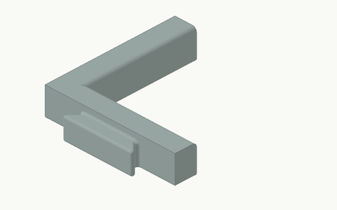</a></td><td><code>corner-in_<wbr>v3_<wbr>original</code><br>Key: <code>corner-in-v3</code></td><td>variant 3<br>Bounds: 66.0 x 60.0 x 13.0 mm</td><td>An R3 corner finishing piece in one of four supported joining arrangements.</td></tr>
<tr><td width="206"><a href="images/attachments/corner-in-v4.png">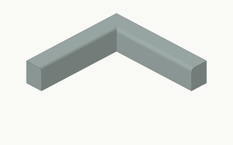</a></td><td><code>corner-in_<wbr>v4_<wbr>original</code><br>Key: <code>corner-in-v4</code></td><td>variant 4<br>Bounds: 60.0 x 60.0 x 13.0 mm</td><td>An R3 corner finishing piece in one of four supported joining arrangements.</td></tr>
</tbody></table>

## Outer corners

<table><thead><tr><th width="206">Thumbnail</th><th>Name</th><th>Size / variant</th><th>What it does</th></tr></thead><tbody>
<tr><td width="206"><a href="images/attachments/corner-out-v1.png">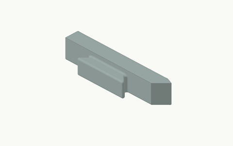</a></td><td><code>corner-out_<wbr>v1_<wbr>original</code><br>Key: <code>corner-out-v1</code></td><td>variant 1<br>Bounds: 16.0 x 67.1 x 13.0 mm</td><td>An R3 outer-edge finishing piece in one of six supported arrangements.</td></tr>
<tr><td width="206"><a href="images/attachments/corner-out-v2.png">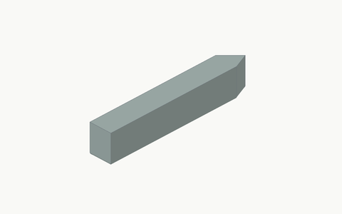</a></td><td><code>corner-out_<wbr>v2_<wbr>original</code><br>Key: <code>corner-out-v2</code></td><td>variant 2<br>Bounds: 67.1 x 10.0 x 13.0 mm</td><td>An R3 outer-edge finishing piece in one of six supported arrangements.</td></tr>
<tr><td width="206"><a href="images/attachments/corner-out-v3.png">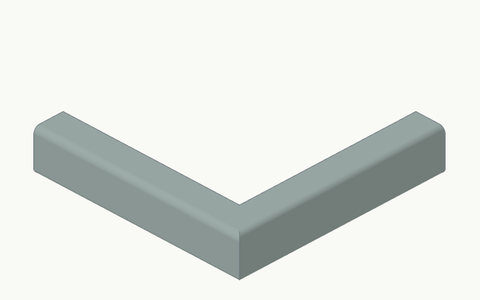</a></td><td><code>corner-out_<wbr>v3_<wbr>original</code><br>Key: <code>corner-out-v3</code></td><td>variant 3<br>Bounds: 70.0 x 70.0 x 13.0 mm</td><td>An R3 outer-edge finishing piece in one of six supported arrangements.</td></tr>
<tr><td width="206"><a href="images/attachments/corner-out-v4.png">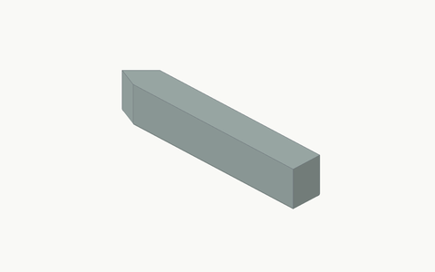</a></td><td><code>corner-out_<wbr>v4_<wbr>original</code><br>Key: <code>corner-out-v4</code></td><td>variant 4<br>Bounds: 10.0 x 67.1 x 13.0 mm</td><td>An R3 outer-edge finishing piece in one of six supported arrangements.</td></tr>
<tr><td width="206"><a href="images/attachments/corner-out-v5.png">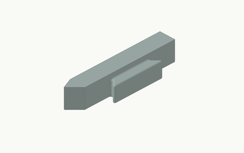</a></td><td><code>corner-out_<wbr>v5_<wbr>original</code><br>Key: <code>corner-out-v5</code></td><td>variant 5<br>Bounds: 67.1 x 16.0 x 13.0 mm</td><td>An R3 outer-edge finishing piece in one of six supported arrangements.</td></tr>
<tr><td width="206"><a href="images/attachments/corner-out-v6.png">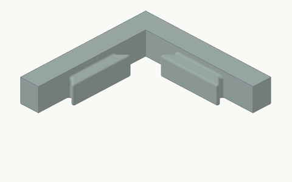</a></td><td><code>corner-out_<wbr>v6_<wbr>original</code><br>Key: <code>corner-out-v6</code></td><td>variant 6<br>Bounds: 70.0 x 70.0 x 13.0 mm</td><td>An R3 outer-edge finishing piece in one of six supported arrangements.</td></tr>
</tbody></table>

## Support rails

<table><thead><tr><th width="206">Thumbnail</th><th>Name</th><th>Size / variant</th><th>What it does</th></tr></thead><tbody>
<tr><td width="206"><a href="images/attachments/support-1.png">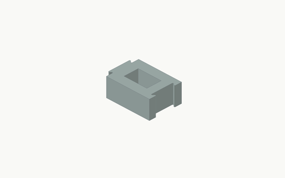</a></td><td><code>support_<wbr>1_<wbr>original</code><br>Key: <code>support-1</code></td><td>1 cell<br>Bounds: 45.0 x 65.0 x 25.0 mm</td><td>An R3 physical bearing rail with rounded windows and separate end-to-end joins.</td></tr>
<tr><td width="206"><a href="images/attachments/support-2.png">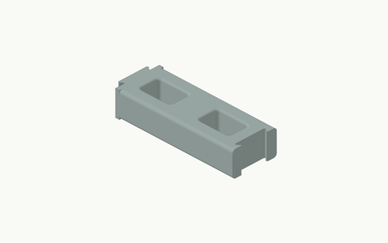</a></td><td><code>support_<wbr>2_<wbr>original</code><br>Key: <code>support-2</code></td><td>2 cells<br>Bounds: 45.0 x 125.0 x 25.0 mm</td><td>An R3 physical bearing rail with rounded windows and separate end-to-end joins.</td></tr>
<tr><td width="206"><a href="images/attachments/support-3.png">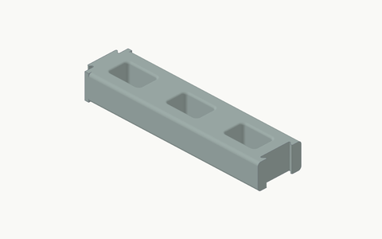</a></td><td><code>support_<wbr>3_<wbr>original</code><br>Key: <code>support-3</code></td><td>3 cells<br>Bounds: 45.0 x 185.0 x 25.0 mm</td><td>An R3 physical bearing rail with rounded windows and separate end-to-end joins.</td></tr>
<tr><td width="206"><a href="images/attachments/support-4.png">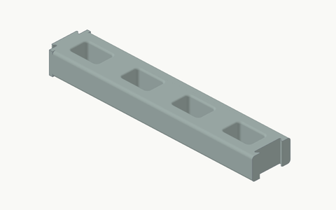</a></td><td><code>support_<wbr>4_<wbr>original</code><br>Key: <code>support-4</code></td><td>4 cells<br>Bounds: 45.0 x 245.0 x 25.0 mm</td><td>An R3 physical bearing rail with rounded windows and separate end-to-end joins.</td></tr>
<tr><td width="206"><a href="images/attachments/support-5.png">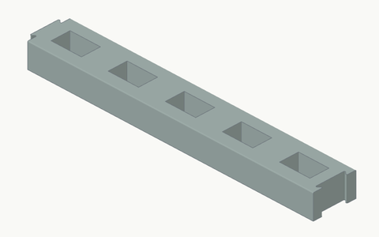</a></td><td><code>support_<wbr>5_<wbr>original</code><br>Key: <code>support-5</code></td><td>5 cells<br>Bounds: 45.0 x 305.0 x 25.0 mm</td><td>An R3 physical bearing rail with rounded windows and separate end-to-end joins.</td></tr>
</tbody></table>

## Rail ends

<table><thead><tr><th width="206">Thumbnail</th><th>Name</th><th>Size / variant</th><th>What it does</th></tr></thead><tbody>
<tr><td width="206"><a href="images/attachments/support-end-v1.png">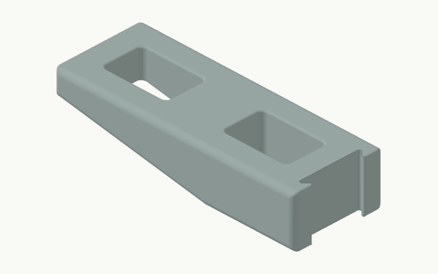</a></td><td><code>support-end_<wbr>v1_<wbr>original</code><br>Key: <code>support-end-v1</code></td><td>variant 1 / X<br>Bounds: 45.0 x 120.0 x 25.0 mm</td><td>A rounded ramped rail end; X, Xs, Y and Ys select the supported arrangements.</td></tr>
<tr><td width="206"><a href="images/attachments/support-end-v2.png">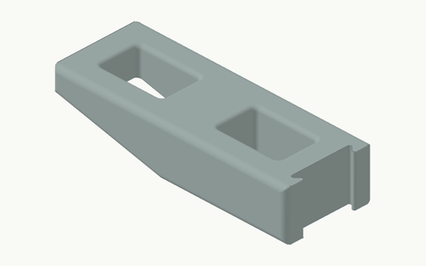</a></td><td><code>support-end_<wbr>v2_<wbr>original</code><br>Key: <code>support-end-v2</code></td><td>variant 2 / Xs<br>Bounds: 45.0 x 120.0 x 25.0 mm</td><td>A rounded ramped rail end; X, Xs, Y and Ys select the supported arrangements.</td></tr>
<tr><td width="206"><a href="images/attachments/support-end-v3.png"></a></td><td><code>support-end_<wbr>v3_<wbr>original</code><br>Key: <code>support-end-v3</code></td><td>variant 3 / Y<br>Bounds: 45.0 x 125.0 x 25.0 mm</td><td>A rounded ramped rail end; X, Xs, Y and Ys select the supported arrangements.</td></tr>
<tr><td width="206"><a href="images/attachments/support-end-v4.png"></a></td><td><code>support-end_<wbr>v4_<wbr>original</code><br>Key: <code>support-end-v4</code></td><td>variant 4 / Ys<br>Bounds: 45.0 x 125.0 x 25.0 mm</td><td>A rounded ramped rail end; X, Xs, Y and Ys select the supported arrangements.</td></tr>
</tbody></table>

## Rail connectors

<table><thead><tr><th width="206">Thumbnail</th><th>Name</th><th>Size / variant</th><th>What it does</th></tr></thead><tbody>
<tr><td width="206"><a href="images/attachments/support-bit-20mm.png"></a></td><td><code>support-bit_<wbr>20mm_<wbr>original</code><br>Key: <code>support-bit-20mm</code></td><td>20 mm length<br>Bounds: 45.0 x 25.0 x 25.0 mm</td><td>A rounded rail connector with a projecting join; the label gives its specified length.</td></tr>
<tr><td width="206"><a href="images/attachments/support-bit-30mm.png"></a></td><td><code>support-bit_<wbr>30mm_<wbr>original</code><br>Key: <code>support-bit-30mm</code></td><td>30 mm length<br>Bounds: 45.0 x 35.0 x 25.0 mm</td><td>A rounded rail connector with a projecting join; the label gives its specified length.</td></tr>
<tr><td width="206"><a href="images/attachments/support-bit-40mm.png"></a></td><td><code>support-bit_<wbr>40mm_<wbr>original</code><br>Key: <code>support-bit-40mm</code></td><td>40 mm length<br>Bounds: 45.0 x 45.0 x 25.0 mm</td><td>A rounded rail connector with a projecting join; the label gives its specified length.</td></tr>
<tr><td width="206"><a href="images/attachments/support-bit-50mm.png"></a></td><td><code>support-bit_<wbr>50mm_<wbr>original</code><br>Key: <code>support-bit-50mm</code></td><td>50 mm length<br>Bounds: 45.0 x 55.0 x 25.0 mm</td><td>A rounded rail connector with a projecting join; the label gives its specified length.</td></tr>
</tbody></table>


## Reproduce the images

Use an external CAD-Pilot checkout at the documented workbench revision with its existing render dependencies installed. No documentation dependency is added to Cargo-Grid's runtime. From this repository root, run:

```sh
PYTHONPATH=src <workbench-python> tools/render_docs.py --workbench <workbench-checkout>
```

Use the workbench's Python interpreter with Pillow already available; paths are supplied locally, not committed. In PowerShell, set `$env:PYTHONPATH='src'` before invoking that interpreter. The script checks geometry modules against the recorded commit, invokes STEP/inspection/render tools, then creates 5 overview PNGs and 56 family-scaled thumbnails. `--compose-only` reuses verified local STEP-derived renders; `--check` verifies the committed files and their one-to-one inventory mapping without Pillow. Intermediate STEP files and raw renders remain ignored. Layout is deterministic; raster bytes can depend on graphics/Pillow versions.

Generator source revision: <code>d0011cc0<wbr>56f6b4e2<wbr>d6aa0f29<wbr>2b57b2e1<wbr>fc1c4a4b</code>. Generator tree: <code>c9b015a2<wbr>ea5059b3<wbr>82955969<wbr>e7033712<wbr>50a340bc</code>. Workbench revision: <code>c3f63ef8<wbr>d8604d3e<wbr>c7eeba40<wbr>a2290478<wbr>87c03d86</code>.

A successful render is not evidence of printability, physical fit, support release or third-party design rights.
